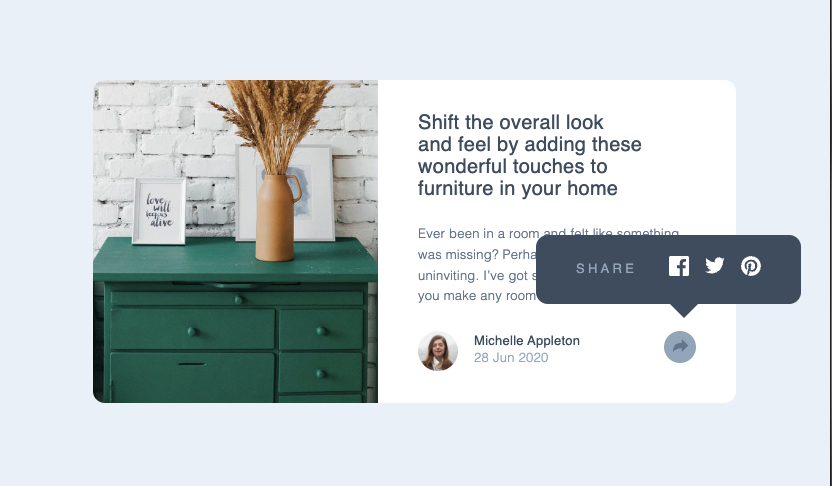

# Frontend Mentor - Article Preview Component

This is a solution to the [Article preview component challenge on Frontend Mentor](https://www.frontendmentor.io/challenges/article-preview-component-dYBN_pYFT). Frontend Mentor challenges help you improve your coding skills by building realistic projects.

## Table of contents

- [Overview](#overview)
  - [Screenshot](#screenshot)
  - [Links](#links)
- [My process](#my-process)
  - [Built with](#built-with)
  - [What I learned](#what-i-learned)
  - [Continued development](#continued-development)
  - [Useful resources](#useful-resources)
- [Author](#author)
- [Acknowledgments](#acknowledgments)

## Overview

### Screenshot



### Links

- Solution Github Repo URL: [Solution repo](https://github.com/cepoumian/social-links-profile)
- Live Site URL: [Solution live](https://cepo-social-links-profile.netlify.app/)

## My process

### Built with

- Web Components
- Semantic HTML5 markup
- Flexbox
- CSS custom properties
- CSS Layers

### What I learned

In this mini project, I wanted to keep working with Web Components, and the share button as well as its corresponding tooltip seemed like good candidates to do so

```js
const template = document.createElement("template");

template.innerHTML = `
  <style>
    div {
      background-color: var(--clr-gray-200);
      position: relative;
      border-radius: 50%;
      width: var(--spacing-300);
      height: var(--spacing-300);;
      display: flex;
      justify-content: center;
      align-items: center;
    }

    div.active {
      background-color: var(--clr-gray-400);
    }

    img {
      transform: translateY(-2px);
    }
  </style>
  <div>
    
  </div>
`;

class ShareButton extends HTMLElement {
  constructor() {
    super();
    this.root = this.attachShadow({ mode: "open" });
    this._active = false;
  }

  connectedCallback() {
    this.root.appendChild(template.content.cloneNode(true));
    this.addEventListener("click", this._toggleActive);
    this.tooltip = document.querySelector("share-tooltip");
  }

  _toggleActive() {
    this._active = !this._active;
    const button = this.root.querySelector("div");
    button.classList.toggle("active", this._active);

    if (this.tooltip) {
      this.tooltip.toggleVisibility(this._active);
    }
  }
}

customElements.define("share-button", ShareButton);
```

I also wanted to keep focusing on what I've learned from the [Every Layout](https://every-layout.dev/) CSS methodology.

The Every Layout book proposes an approach to layout based on classes or web components that tackle one specific task at a time. It also makes special emphasis on utilizing css logical properties (inline, block, etc.) instead of properties that would only work in horizontal-tb writing modes (e.g., margin-block-start instead of margin-top).

For example, the Stack has the single task of adding top margin:

```css
.stack {
  display: flex;
  flex-direction: column;
  justify-content: flex-start;
}

.stack > * {
  margin-block: 0;
}

.stack > * + * {
  margin-block-start: var(--spacing-sm);
}
```

The Cover has the task of centering its content vertically and horizontally:

```css
.cover {
  display: flex;
  flex-direction: column;
  min-block-size: 100vh;
  justify-content: center;
  align-items: center;
  padding: 1rem;
}
```

Finally, I also wanted to keep leveraging CSS layers as a way of organizing styles and managing specificity, as suggested by Kevin Powell in his (Frontend Master's course)[https://frontendmasters.com/courses/pro-css/].

```css
@layer utilities {
  .text\:center {
    text-align: center;
  }

  .bg\:light {
    background-color: var(--background-light);
  }
}
```

```css
@layer utilities {
  .text\:center {
    text-align: center;
  }

  .bg\:light {
    background-color: var(--background-light);
  }
}
```

### Useful resources

- [Web Components Book](https://coryrylan.gumroad.com/l/web-component-essentials?layout=profile) - One valuable resource I'm using to learn about web components.

- [Every Layout](https://www.example.com) - This is, by far, one of the most valuable resources on CSS and web layout I've found. Highly recomended.

- [Kevin Powell's Frontend Master's course](https://frontendmasters.com/courses/pro-css/) - One of CSS's greatest educators.

## Author

- Website - [Cesar Poumian](https://github.com/cepoumian)
- Frontend Mentor - [@cepoumian](https://www.frontendmentor.io/profile/cepoumian)
